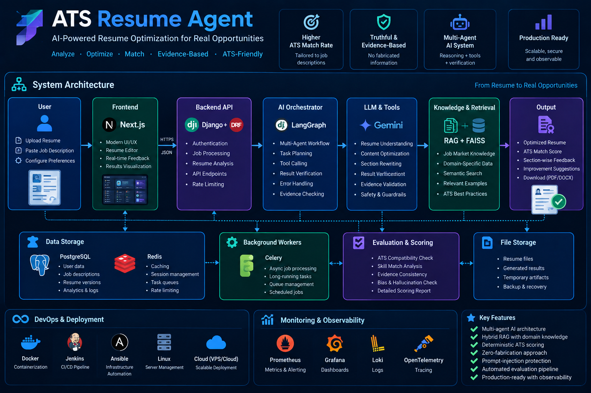
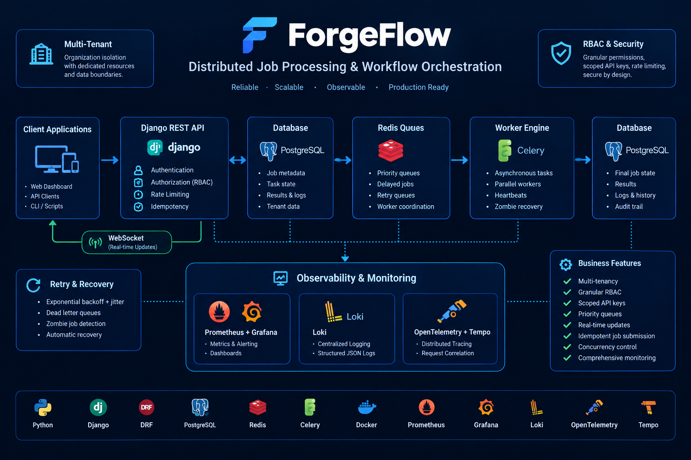

  

  
  
  
  

  
  
  

  

---

# 👋 Hi, I'm Forhad Uddin Ahmed

### AI/ML Researcher & Software Engineer

I build **intelligent software systems and production-oriented backend infrastructure**.

My work sits at the intersection of **Machine Learning, Explainable AI, software engineering, and scalable systems**. I enjoy taking an idea from research or architecture all the way to a working system.

Currently, I'm building products through **InitZone** and exploring research problems around **dependable intelligent systems, AI/ML reliability, and AI-driven software engineering**.

> **I like understanding how systems work under the hood, not just making them work.**

---

## ⚡ At a Glance

<table>
<tr>
<td width="50%">

### 🔬 Research

* Machine Learning
* Explainable AI
* Predictive Modeling
* Intelligent Systems
* AI/ML Reliability
* AI-driven Software Engineering

</td>

<td width="50%">

### ⚙️ Engineering

* Backend Architecture
* Distributed Systems
* REST APIs
* System Design
* DevOps & Observability
* Production AI Systems

</td>
</tr>
</table>

---

## 🚀 Featured Projects

### 🧠 AI-Powered ATS Resume Optimization

  

  

A production-oriented AI system that analyzes resumes against job descriptions and generates **truthful, evidence-grounded, ATS-friendly optimizations**.

**Stack**

`Python` `Django` `DRF` `Next.js` `TypeScript` `PostgreSQL` `Redis` `Gemini` `LangGraph` `RAG` `FAISS` `Docker` `Jenkins` `Ansible` `Prometheus` `Grafana` `Loki`

**Engineering ideas**

* Multi-agent AI
* Hybrid RAG
* Deterministic ATS scoring
* Evidence-grounded generation
* Zero-fabrication architecture
* Prompt-injection protection
* Automated evaluation
* CI/CD & infrastructure automation
* Production observability

> **Core principle:** optimize the candidate's real experience, never invent it.

---

### ⚙️ ForgeFlow — Distributed Job Processing Platform

  

  

A distributed job processing and orchestration platform built to explore how reliable background workloads can be **scheduled, executed, monitored, retried, and recovered** across distributed workers.

**Stack**

`Python` `Django` `DRF` `PostgreSQL` `Redis` `Channels` `WebSockets` `Docker` `Prometheus` `Grafana` `Loki` `OpenTelemetry` `Tempo`

**Engineering ideas**

* Multi-tenancy
* RBAC
* Idempotent job submission
* Priority queues
* Concurrency control
* Worker heartbeats
* Zombie job recovery
* Retry with exponential backoff + jitter
* Distributed rate limiting
* Scoped API keys
* Real-time job updates
* Metrics, logging & tracing

> **Core principle:** distributed systems should be designed for failure, not just the happy path.

---

## 🎨 Visual Highlights

<table>
<tr>
<td width="50%" align="center">

### 🤖 ATS Resume Agent

AI-powered resume analysis, optimization, retrieval, evaluation, and evidence validation.

</td>

<td width="50%" align="center">

### ⚙️ ForgeFlow

Distributed job processing, queue management, worker execution, recovery, and observability.

</td>
</tr>
</table>

  <i>Architecture diagrams and engineering experiments from systems I build.</i>

---

## 📚 Research

My research interests focus on the intersection of **Machine Learning, Explainable AI, predictive modeling, and dependable intelligent systems**.

### Selected Research

| Area                   | Work                                                |
| ---------------------- | --------------------------------------------------- |
| 🧠 Healthcare AI       | Brain Stroke Prediction using Machine Learning      |
| ₿ Financial AI         | Bitcoin Price Forecasting                           |
| 🔍 Explainable AI      | Feature Selection & Explainable Predictive Modeling |
| 🤖 Intelligent Systems | Reliability and evaluation of AI/ML systems         |

### Publications

* 📄 Peer-reviewed research on **Bitcoin Price Forecasting**
* 🧠 Research on **Brain Stroke Prediction using Machine Learning**
* 🎓 First-author research presented at **IEEE conferences**, including ICICT4SD and ICCIT

I'm currently exploring research problems involving:

`Machine Learning` · `XAI` · `NLP` · `LLMs` · `AI-driven Software Engineering` · `Dependable AI` · `AI/ML Reliability`

---

## 🏢 InitZone

  

I'm the **Founder of InitZone**, a technology and software company focused on building **digital products, platforms, and intelligent systems**.

### Products

**📖 Portulika**

A reading and writing platform connecting writers and readers through stories, series, chapters, subscriptions, and digital publishing.

**⚽ TurfzBD**

A platform focused on simplifying turf discovery and sports-slot booking.

**🧩 InitZone**

The engineering and product ecosystem behind our digital products and intelligent systems.

---

## 🧑‍💻 Engineering Stack

  

### Backend

`Python` · `Django` · `Django REST Framework` · `FastAPI`

### Data

`PostgreSQL` · `MySQL` · `SQLite` · `Redis`

### Frontend

`React` · `Next.js` · `TypeScript` · `Tailwind CSS`

### Infrastructure

`Docker` · `Linux` · `Nginx` · `GitHub Actions` · `Jenkins` · `Ansible`

### Observability

`Prometheus` · `Grafana` · `Loki` · `OpenTelemetry` · `Tempo`

### AI / ML

`Machine Learning` · `Explainable AI` · `LLMs` · `RAG` · `FAISS` · `LangGraph`

---

## 🏆 Competitive Programming

**3× ICPC Asia Dhaka Regional Contestant**

* 🥇 ICPC Asia Dhaka Regional — **2021, 2022, 2023**
* 🧠 **700+** algorithmic problems solved
* 🏁 Multiple IUPC contests including SUST and CUET
* 👨‍💻 Former **General Secretary, BAIUST Computer Club**
* 🧩 IUPC problem setter & judge

Competitive programming shaped the way I approach **algorithms, complexity, debugging, and problem decomposition**.

---

## 🎓 Teaching & Mentorship

### Former University Lecturer

Taught courses and labs involving:

`Data Structures` · `Algorithms` · `Discrete Mathematics` · `Structured Programming` · `Numerical Analysis`

### EDGE Bangladesh

Trained **50+ participants in Python/Django** under the EDGE project.

### Technical Community

* 🎤 CSE FEST 2025 speaker
* 🧩 CSE FEST 2023 IUPC problem setter & judge
* 👨‍🏫 Competitive programming and software engineering mentorship

---

## 🧭 Currently Exploring

`System Design`
`Distributed Systems`
`Redis Internals`
`Kubernetes`
`Scalable Backend Architecture`
`Production AI/ML`
`Dependable Intelligent Systems`

---

## 📊 GitHub Activity

  
  

  

  <picture>
    <source media="(prefers-color-scheme: dark)" srcset="https://raw.githubusercontent.com/FForhad/FForhad/output/github-contribution-grid-snake-dark.svg">
    <source media="(prefers-color-scheme: light)" srcset="https://raw.githubusercontent.com/FForhad/FForhad/output/github-contribution-grid-snake.svg">
    
  </picture>

---

## 🌐 Find Me Online

---

### 📄 Resume

* [Industrial Resume](https://drive.google.com/file/d/1L-Om0ppZu1dBgptgUSnWwY9jQrtLEt7N/view?usp=sharing)
* [Academic Resume](https://drive.google.com/file/d/18o_VWbkKODwApCMoEG1Quo9l8xFzLRet/view?usp=sharing)

---

  

  <strong>Build. Research. Learn. Repeat.</strong>

  Thanks for stopping by 👋

